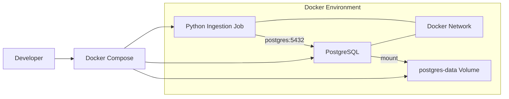
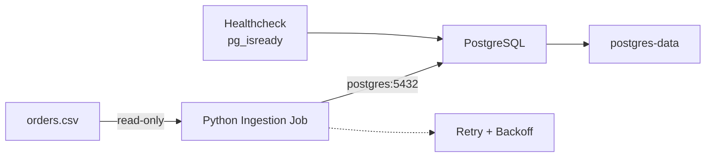

```mermaid
flowchart LR
    Dev[Developer]
    Compose[Docker Compose]

    subgraph Docker["Docker Environment"]
        Network["Docker Network"]

        Python["Python Ingestion Job"]
        Postgres["PostgreSQL"]
        Volume["postgres-data Volume"]

        Python -->|postgres:5432| Postgres
        Python --- Network
        Postgres --- Network
        Postgres -->|mount| Volume
    end

    Dev --> Compose
    Compose --> Python
    Compose --> Postgres
    Compose --> Volume
```

```mermaid
flowchart LR
    Dataset["orders.csv"]
    Ingestion["Python Ingestion Job"]
    Postgres["PostgreSQL"]
    Volume["postgres-data"]

    Dataset -->|"read-only"| Ingestion
    Ingestion -->|"postgres:5432"| Postgres
    Postgres --> Volume

    Health["Healthcheck<br/>pg_isready"]
    Health --> Postgres

    Retry["Retry + Backoff"]
    Ingestion -.-> Retry
```