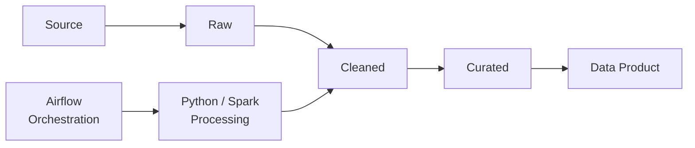
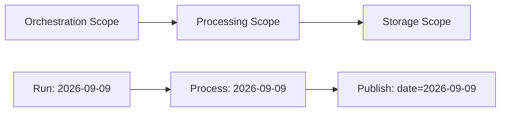
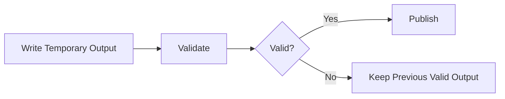
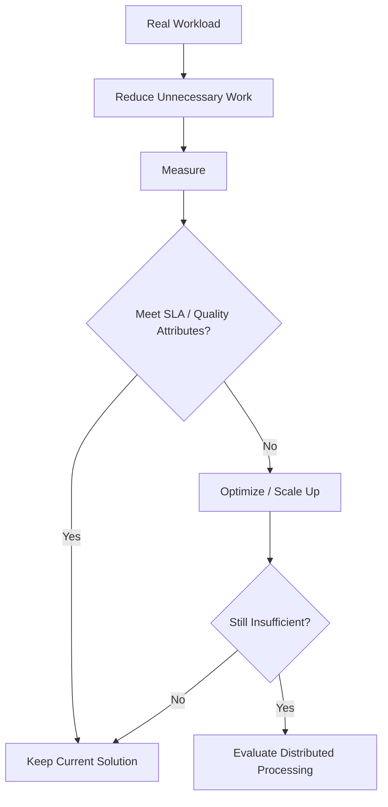
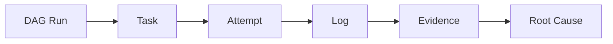
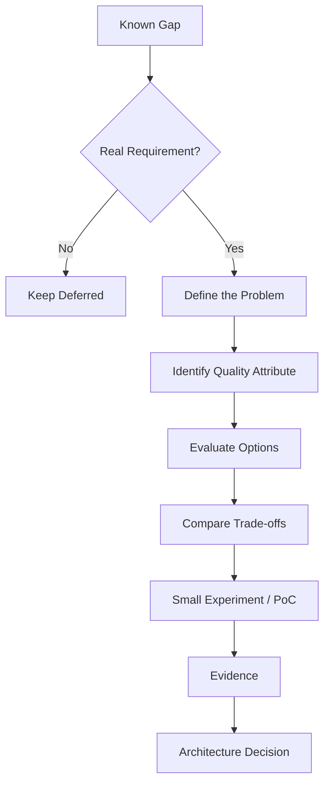
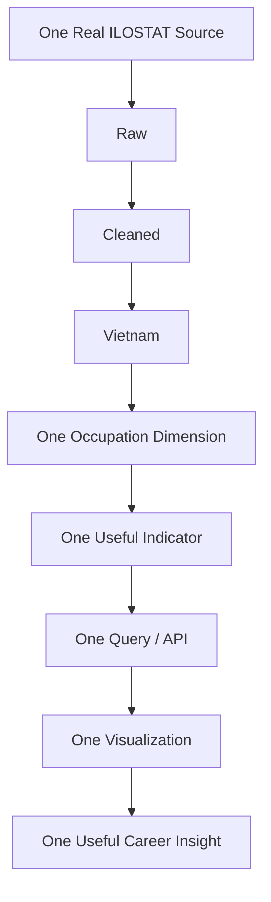

# Production Gap Map

## 1. Purpose

The Big Data Playground is an **architectural walking skeleton**, not a production-ready platform.

Its purpose was to validate the core architectural concepts through small experiments and evidence.

Therefore, several production concerns were deliberately not implemented.

These are not forgotten requirements.

They are **deferred complexity**:

> Complexity that is intentionally postponed until a real requirement justifies its cost.

This document records those gaps and provides a decision framework for revisiting them in the ILOSTAT Career Data Platform.

---

## 2. Current Playground Baseline

The Playground currently validates the following architecture:

The main capabilities already demonstrated are:

| Area | Validated Capability |
|---|---|
| Ingestion | Containerized ingestion and PostgreSQL bulk loading |
| Storage | Parquet and workload-aware partitioning |
| Query Optimization | Partition pruning, column pruning, data skipping, predicate pushdown |
| Data Lake | Raw → Cleaned → Curated |
| Data Quality | Basic validation and data contracts |
| Processing | Python and Spark fundamentals |
| Distributed Processing | Partition, task, executor, shuffle, retry and lineage |
| Orchestration | Dependency, scheduling, state, retry and backfill |
| Observability | DAG → Task → Attempt → Log → Cause |
| Architecture | Evidence-based technology and trade-off decisions |

This is the baseline from which future ILOSTAT requirements will evolve.

---

# 3. Production Gaps

## 3.1 Storage

### Playground

Data is stored on the local filesystem.

### Production Gap

A production system may require object or distributed storage.

Examples of future concerns include:

- storage capacity;
- durability;
- concurrent access;
- lifecycle management;
- backup and recovery;
- cost.

### Decision Rule

Do not introduce object or distributed storage simply because the project is called Big Data.

Introduce it when the storage requirements exceed what the current solution can reasonably provide.

**Status: Deferred**

---

## 3.2 Data Format and Schema Evolution

### Playground

Parquet is used as the analytical storage format.

We validated:

- columnar storage;
- row groups;
- column pruning;
- predicate pushdown;
- data skipping.

### Production Gap

The Playground does not solve long-term schema evolution.

Future questions may include:

- What happens when a column is added?
- What happens when a data type changes?
- Can old and new files be queried together safely?
- How are incompatible schema changes detected?

Technologies for solving these problems should be evaluated only when the problem appears.

**Status: Deferred**

---

## 3.3 Data Lake Governance

### Playground

The lake uses three logical zones:

**Raw → Cleaned → Curated**

Their responsibilities are:

| Zone | Responsibility |
|---|---|
| Raw | Preserve source truth |
| Cleaned | Validate and normalize |
| Curated | Add business meaning |

### Production Gap

A larger platform may eventually require:

- data catalog;
- ownership;
- lineage;
- metadata management;
- retention rules;
- access policies;
- governance.

These capabilities are not required by the current walking skeleton.

**Status: Deferred**

---

## 3.4 Date-aware Processing

### Playground

Airflow can create scheduled and historical runs.

However, the existing processing jobs do not receive an explicit business date or data interval.

Therefore:

> **Airflow can backfill, but this does not mean the processing pipeline is business-backfill-correct.**

### Production Gap

A reliable historical pipeline should align three boundaries:

For example, a future processing contract could explicitly receive:

`business_date = 2026-09-09`

and process only that logical slice.

### Decision Rule

Implement date-aware processing when ILOSTAT introduces scheduled or historical processing where independent time slices must be reproduced safely.

**Status: Identified, not implemented**

---

## 3.5 Atomic Publishing

### Playground

Processing writes output files directly.

During the Data Lake experiment, we observed an important risk:

A failed processing run can leave the previous valid output in place or potentially expose incomplete output depending on the publishing strategy.

### Production Gap

A safer publishing model is:

The architectural principle is:

> **Publish only validated data.**

Partition-scoped publishing can further reduce the recovery boundary.

### Decision Rule

Introduce atomic publishing when failed or concurrent processing could expose invalid business data.

**Status: Identified, not implemented**

---

## 3.6 Distributed Processing

### Playground

Spark fundamentals were validated.

We learned:

- processing partitions;
- tasks and executors;
- parallelism;
- shuffle;
- stages;
- data skew;
- retry;
- lineage.

### Production Gap

The Playground does not include:

- production Spark cluster deployment;
- cluster sizing;
- resource tuning;
- production shuffle optimization;
- autoscaling.

This is intentional.

### Decision Rule

Spark must not be introduced into ILOSTAT merely because the dataset is large.

Use the following reasoning:

The principle is:

> **Before adding compute, reduce unnecessary work.**

**Status: Fundamentals validated; production depth deferred**

---

## 3.7 Workflow Orchestration

### Playground

Apache Airflow was validated through Sessions 27–29 and accepted through ADR-003.

We demonstrated:

- dependencies;
- scheduling;
- state;
- retry;
- backfill;
- execution history;
- failure localization.

### Production Gap

The Playground uses a simple local Airflow deployment.

It does not evaluate:

- production deployment;
- high availability;
- production authentication;
- scaling;
- upgrades;
- production metadata database operations.

### ILOSTAT Boundary

Airflow is **not automatically selected for ILOSTAT**.

Suppose the first ILOSTAT MVP has:

- one source;
- one country;
- a few jobs;
- weekly execution;
- simple dependencies.

The coordination complexity may not yet justify operating Airflow.

### Decision Rule

Ask:

> **Has coordination complexity become large enough that an orchestrator provides more value than the operational cost it introduces?**

If the answer is no, use a simpler solution.

**Status: Accepted for Playground; reevaluate for ILOSTAT**

---

## 3.8 Production Observability

### Playground

Session 29 validated the troubleshooting path:

This is enough for the current learning environment.

### Production Gap

A real platform may eventually require:

- centralized metrics;
- alerting;
- distributed tracing;
- dashboards;
- SLO monitoring;
- long-term operational history.

### Decision Rule

Do not introduce an observability stack merely because production systems commonly have one.

First identify what operational question cannot be answered with the existing evidence.

Then introduce the smallest capability that answers it.

The principle remains:

> **Localize the failure before diagnosing the cause.**

**Status: Basic observability validated; production depth deferred**

---

## 3.9 Security

### Playground

Security is intentionally minimal.

### Production Gap

A production environment may require:

- authentication;
- authorization;
- secret management;
- service credentials;
- encryption;
- auditability.

The exact solution depends on the deployment environment and security requirements of ILOSTAT.

**Status: Deferred**

---

## 3.10 Reliability and Disaster Recovery

### Playground

We validated several local reliability mechanisms:

- readiness checks;
- retry;
- task-level recovery;
- lineage;
- backfill.

### Production Gap

We have not designed:

- high availability;
- disaster recovery;
- backup strategy;
- recovery objectives;
- multi-node failure handling.

These require explicit production reliability requirements.

**Status: Deferred**

---

## 3.11 Data Quality

### Playground

Basic validation and data contracts were demonstrated in the Cleaned layer.

### Production Gap

ILOSTAT may eventually require continuous monitoring for:

- missing data;
- unexpected schema changes;
- abnormal values;
- freshness;
- completeness;
- historical consistency.

The exact quality rules must come from real ILOSTAT data and business meaning.

**Status: Basic validation implemented; continuous monitoring deferred**

---

## 3.12 Deployment and Operations

### Playground

The environment runs locally with Docker Compose.

### Production Gap

The Playground does not define:

- production CI/CD;
- environment promotion;
- infrastructure provisioning;
- production configuration management;
- rollback;
- deployment strategy.

These should be designed from the actual hosting and operational requirements of ILOSTAT.

**Status: Deferred**

---

# 4. Gap Summary

| Area | Playground Status | Future Trigger |
|---|---|---|
| Object Storage | Deferred | Local storage becomes insufficient |
| Schema Evolution | Deferred | Schemas begin changing over time |
| Governance / Catalog | Deferred | Data ownership/discovery becomes difficult |
| Date-aware Processing | Identified | Scheduled/backfill processing requires exact time scope |
| Atomic Publishing | Identified | Failed/concurrent writes can expose invalid data |
| Distributed Processing | Fundamentals validated | Optimized single-machine processing misses SLA |
| Airflow Production Deployment | Deferred | Coordination complexity justifies Airflow in target system |
| Production Observability | Deferred | Existing evidence cannot answer operational questions |
| Security | Deferred | Real deployment/security requirements appear |
| HA / Disaster Recovery | Deferred | Availability/recovery objectives require it |
| Continuous Data Quality | Deferred | Real data requires ongoing quality guarantees |
| Production CI/CD | Deferred | Real deployment lifecycle exists |

---

# 5. How to Use This Map

This file is **not a future implementation checklist**.

A gap should not automatically become a task.

Instead:

This prevents the Production Gap Map from becoming a technology shopping list.

---

# 6. Transition to ILOSTAT

The Playground was **learning-driven**:

> Learn a concept → create an experiment → observe evidence → build a mental model.

ILOSTAT will be **problem-driven**:

> Find a real problem → understand requirements → make the smallest useful architecture decision → implement → measure → evolve.

The first ILOSTAT vertical slice should therefore remain intentionally small:

The first goal is **not**:

> Build a Big Data Platform.

The first goal is:

> **Use real labour-market data to produce one useful career insight for a real stakeholder.**

If that vertical slice works, the platform has its first heartbeat.

---

# 7. Architecture Rule for ILOSTAT

Before introducing any new technology, answer these questions:

1. What problem are we solving?
2. What evidence shows that the problem actually exists?
3. Which Quality Attribute is affected?
4. What happens if we do nothing?
5. What options can solve the problem?
6. What benefit does each option provide?
7. What trade-off does each option introduce?
8. Is there a simpler option?
9. What experiment can validate the decision?

The governing rule carried from the Big Data Playground into ILOSTAT is:

> **No technology without a problem.  
> No decision without a trade-off.  
> No claim without evidence.**