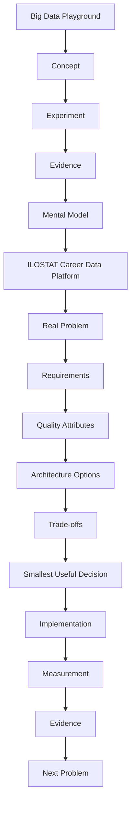

## Big Data Playground — Completed

The Big Data Playground is complete.

The goal of the Playground was not to build a production-ready Big Data platform.

Its purpose was to learn and validate the architectural skeleton behind:

- data ingestion;
- analytical storage;
- query optimization;
- data lake architecture;
- distributed processing;
- workflow orchestration;
- failure recovery and observability;
- evidence-based architecture decisions.

The next learning phase moves from a learning-driven environment to a real problem-driven project:

**ILOSTAT Career Data Platform**

Future technologies will not be introduced because they belong to a predefined Big Data stack.

They will be introduced only when real requirements justify them.

### Transition Principle

```text
Big Data Playground

Concept
 ↓
Experiment
 ↓
Evidence
 ↓
Mental Model

        TRANSITION

ILOSTAT Career Data Platform

Real Problem
 ↓
Requirements
 ↓
Quality Attributes
 ↓
Architecture Options
 ↓
Trade-offs
 ↓
Smallest Useful Decision
 ↓
Implementation
 ↓
Measurement
 ↓
Evidence
 ↓
Next Problem
```

```text

                    DATA SOURCES

           ILOSTAT   Job Data   Education
              │         │           │
              └─────────┼───────────┘
                        ▼

                   DATA LAKE
                        │
             ┌──────────┴──────────┐
             │                     │
            Raw                 Cleaned
             │                     │
             └──────────┬──────────┘
                        ▼
                     Curated
                        │
                        ▼
               DATA WAREHOUSE
                        │
              Integrated Labour
                Market Model
                        │
          ┌─────────────┼─────────────┐
          ▼             ▼             ▼
      Student        Workforce     University
      Data Mart       Data Mart     Data Mart
          │             │             │
          ▼             ▼             ▼
      Student        Business      University
      Product        Product       Product
```

## Big Data Playground — Completed

The Big Data Playground is complete.

The goal of the Playground was not to build a production-ready Big Data platform. Its purpose was to learn and validate the architectural foundations behind:

- data ingestion;
- analytical storage;
- query optimization;
- data lake architecture;
- distributed processing;
- workflow orchestration;
- failure recovery and observability;
- evidence-based architecture decisions.

The next learning phase moves from a learning-driven environment to a real problem-driven project:

**ILOSTAT Career Data Platform**

Future technologies will not be introduced simply because they belong to a predefined Big Data stack. They will be introduced only when real requirements justify them.

### Transition Principle

